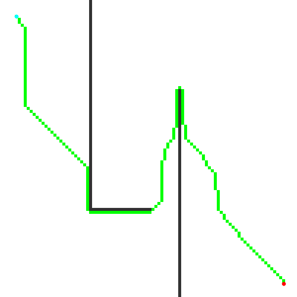
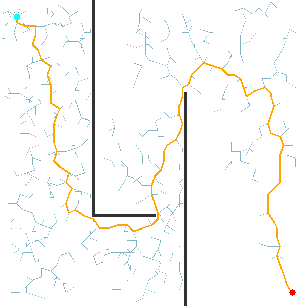

# C++ Motion Planner

A from-scratch C++17 motion planning library implementing **A\*** and **RRT** on 2D occupancy grids, with OpenCV visualization.

<p align="center">
  
  
</p>

## Algorithms

| Algorithm | Type | Complexity | Optimality |
|-----------|------|------------|------------|
| **A\*** | Graph search | O(E log V) | ✅ Optimal shortest path |
| **RRT** | Sampling-based | O(n log n) | ❌ Feasible path (not optimal) |

## Performance Optimizations

This project prioritizes **cache-friendly data structures** and **algorithmic efficiency**:

- **Flat 1D grid** - The occupancy grid stores cells in a contiguous `std::vector<CellType>` (row-major) instead of `vector<vector<>>`, maximizing L1/L2 cache utilization during grid traversals.
- **Indexed Priority Queue (SoA layout)** - Custom min-heap with O(log n) `decreaseKey` for A\*. Uses Structure-of-Arrays (three parallel vectors) instead of Array-of-Structs, keeping heap indices packed for tighter sift loops. This gives true O(E log V) vs the common O(E log E) with `std::priority_queue`.
- **Dynamic KD-Tree** - 2D spatial index for RRT nearest-neighbor queries. Reduces per-iteration cost from O(n) brute-force to O(log n). Stored as a flat vector of `{index, left, right}` nodes.
- **Squared-distance comparisons** - All nearest-neighbor searches use `distSq()` to avoid `std::sqrt` in the inner loop. The sqrt is only computed once per iteration for the steer step.
- **Index-based trees** - Both the RRT tree and KD-Tree use integer indices into flat vectors instead of pointers, avoiding invalidation on vector growth and improving memory access patterns.

## Project Structure

```
cpp-motion-planner/
├── include/motion_planner/
│   ├── grid.hpp                  # 2D occupancy grid
│   ├── astar.hpp                 # A* planner + PlanResult
│   ├── indexed_priority_queue.hpp # Min-heap with decreaseKey
│   ├── rrt.hpp                   # RRT planner + RRTResult/RRTConfig
│   └── visualizer.hpp            # OpenCV rendering
├── src/
│   ├── grid.cpp
│   ├── astar.cpp
│   ├── rrt.cpp
│   ├── visualizer.cpp
│   └── main.cpp                  # Demo: A* and RRT side-by-side
├── tests/
│   ├── test_grid.cpp             # 8 unit tests
│   ├── test_astar.cpp            # 6 unit tests
│   └── test_rrt.cpp              # 4 unit tests
└── CMakeLists.txt
```

## Build & Run

**Dependencies:** CMake ≥ 3.14, C++17 compiler, OpenCV, GoogleTest

```bash
cmake -B build -DCMAKE_BUILD_TYPE=Release
cmake --build build
./build/motion_planner
```

## Testing

```bash
cd build && ctest --output-on-failure
```

18 unit tests covering Grid, A\*, and RRT:

```
100% tests passed, 0 tests failed out of 18
```

## From Learning Project to Real Robots

> **Note:** This project is built for learning and demonstration purposes. Production robotics systems use mature, highly optimized libraries like [OMPL](https://ompl.kavrakilab.org/), [Nav2](https://docs.nav2.org/), and [MoveIt](https://moveit.ai/). The goal here is to understand the algorithms from scratch before using those tools.

That said, extending this code toward real-world use is a natural next step:

**Mobile robots (A\* path):**
- Swap the uniform grid for a costmap (weighted cells instead of binary free/obstacle) to handle terrain preferences
- Integrate with ROS 2 Nav2 - publish the planned path as a `nav_msgs/Path` and feed it to a trajectory controller
- Add D\* Lite for dynamic replanning when new obstacles appear mid-navigation

**Manipulators (RRT path):**
- Extend the planner from 2D grid coordinates to N-dimensional joint space (the KD-Tree already generalizes to any dimension)
- Add path smoothing via shortcutting or B-spline interpolation to remove the jagged RRT waypoints
- Implement RRT\* - rewire the tree after each insertion to converge toward the shortest path
- Grow trees from both start and goal simultaneously (Bidirectional RRT / RRT-Connect) for faster convergence in narrow passages
